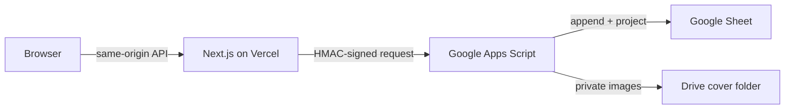

# Focus Shelf

Focus Shelf is a deliberately constrained personal learning tracker: one **Main** focus, one **Side** focus, an unlimited **Parking** queue, and explicit **Paused**, **Done**, and **Dropped** outcomes. It is a responsive Next.js application backed by Google Sheets and a private Google Drive cover folder.

## What is included

- Focus board with enforced Main/Side capacity, queue management, covers, resource links, manual next steps, flexible units, and progress correction.
- Weekly analytics in Cairo time: active days, resources advanced, completions, unit-safe net progress, and a short reflection.
- Light and dark themes, phone/tablet/desktop layouts, keyboard-visible focus, reduced-motion support, and high-contrast light-theme text.
- Event-sourced Google Sheet history with idempotent writes, optimistic concurrency, and serialized slot changes.
- Private access-phrase session, same-origin mutation checks, signed Vercel-to-Apps-Script requests, and private cover delivery.

## Architecture at a glance



The browser never receives the Apps Script secret, the Sheet ID, or a public Drive image link. Learning data is not stored in `localStorage`; only the selected theme is stored in a same-site cookie.

## Local development

Requirements: Node.js 22+ and a configured Apps Script deployment.

```bash
npm ci
cp .env.example .env.local
npm run dev
```

Validation:

```bash
npm test
npm run typecheck
npm run build
```

See [docs/setup.md](docs/setup.md) for Google Apps Script and Vercel configuration. The implementation reference is [PROJECT_REFERENCE.md](PROJECT_REFERENCE.md).

## Repository map

| Path | Responsibility |
|---|---|
| `app/` | Pages and authenticated server API routes |
| `components/focus-app.tsx` | Board, analytics, dialogs, forms, and client interactions |
| `lib/server.ts` | Sessions, origin validation, signing, backend bridge |
| `lib/analytics.mjs` | Cairo calendar and weekly aggregation |
| `apps-script/` | Google-side domain rules, event log, projections, cover storage |
| `tests/` | Domain and analytics regression tests |
| `docs/` | Architecture, API, rules, flows, decisions, setup, and AI handoff |

## Current external resources

- Google Sheet: `1_3igOWIRdRiCt_zhjDw_adN884ywR5rB8Al_67DKsf8`
- Cover folder: `1D-f6j3Be00ZYd4-h_0PRel0IH71iVthW`
- Drive project folder: `1MQhaHHdWK5YFsxN4Eq5oEYr3raVVy-WU`

Never commit deployment secrets. Rotate `APPS_SCRIPT_SECRET`, `SESSION_SECRET`, and the access phrase if they are exposed.
# focus-shelf
