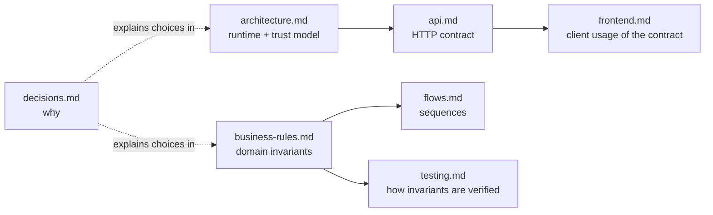

# Documentation index

Start with [`../PROJECT_REFERENCE.md`](../PROJECT_REFERENCE.md) for the product statement, status matrix, and data dictionary, and [`../README.md`](../README.md) for the quickstart. Then read the file below that matches what you're doing.

| File | Read this when… |
|---|---|
| [`architecture.md`](architecture.md) | You need the runtime boundaries, the event-log/projection consistency model, or the trust/security boundaries between browser, Vercel, and Apps Script. |
| [`api.md`](api.md) | You're calling or changing `/api/session`, `/api/data`, or `/api/cover/:id`, or the signed Vercel-to-Apps-Script protocol. |
| [`business-rules.md`](business-rules.md) | You're changing focus-capacity, progress, lifecycle, or weekly-analytics rules — the domain invariants, not their implementation. |
| [`frontend.md`](frontend.md) | You're working in `components/focus-app.tsx` — state shape, the optimistic save/retry pattern, dialogs, demo mode, or theming. |
| [`flows.md`](flows.md) | You want the end-to-end user/system sequence for a specific action (add, progress, finish, weekly review). |
| [`testing.md`](testing.md) | You're adding or changing a test in `tests/`. |
| [`decisions.md`](decisions.md) | You want the "why" behind a structural choice (Sheets as DB, event sourcing, manual next step, access phrase, no component framework, etc.). |
| [`setup.md`](setup.md) | You're deploying or configuring the Apps Script backend or Vercel environment. |
| [`ai-handoff.md`](ai-handoff.md) | You're an AI assistant making a change and want the fast-context invariants and safe-change procedure first. |

## How the pieces fit together

`business-rules.md` is the source of truth for *what* is valid. `api.md` and `frontend.md` describe *how* that gets enforced across the wire and in the UI, respectively. If code and docs ever disagree, the source-of-truth precedence in [`ai-handoff.md`](ai-handoff.md) applies.
