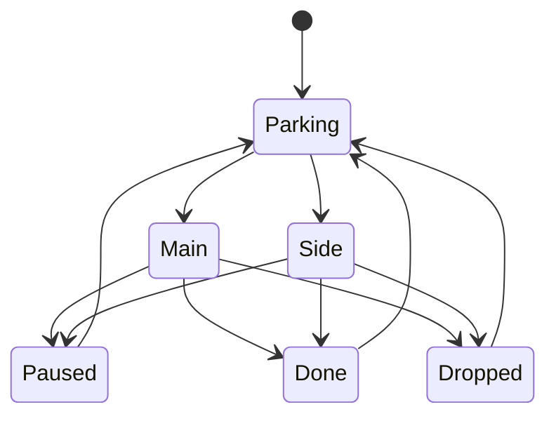

# Business rules

## Focus capacity

- Exactly zero or one item may be in `Main`.
- Exactly zero or one item may be in `Side`.
- Parking, Paused, Done, and Dropped are unbounded.
- A slot becomes available immediately after Pause, Done, or Drop.
- Server-side enforcement is authoritative; disabled UI buttons are only guidance.

## Progress

- Supported units: Pages, Chapters, Lessons, Minutes, Hours, Percent, Custom.
- Pages, chapters, and lessons are whole numbers. Other units allow two decimals.
- Percent always has total 100. Other totals may be unknown.
- Progress is an absolute current value in the command and a signed delta in the event.
- Decreasing progress is allowed as a correction. Analytics reports net progress.
- A resource must be Main or Side before recording progress.
- Unit changes are blocked after progress is recorded.
- Done does not force 100%; finishing means the user received the intended value.

## Next step

`nextStep` is intentionally manual. “Next: Chapter 4 — Managing complexity” is stored as ordinary item text, edited from the resource dialog, and preserved until the user changes it. The application does not infer chapters from progress or book metadata.

## Lifecycle

All supported states can be selected by the backend; the UI presents the transitions that fit the current context.

## Weekly analytics

- Weeks are Sunday–Saturday in `Africa/Cairo`.
- Active day: at least one positive progress event that local day.
- Resources advanced: distinct resources with positive progress during the week.
- Completed: distinct transitions into Done.
- Progress: sum of signed deltas grouped by resource and unit. Different units are never combined.
